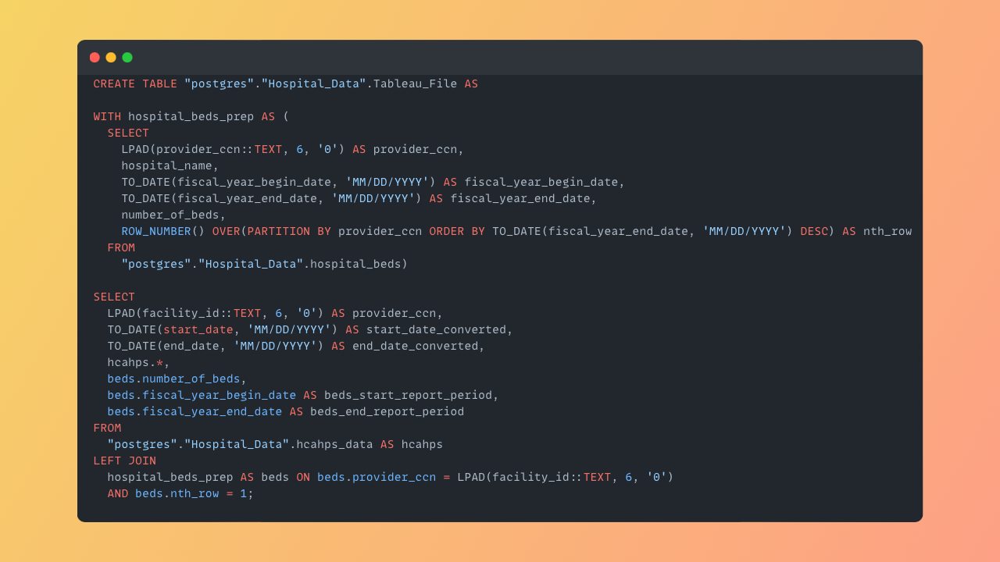

# Patient Satisfaction Score

This repository contains a SQL query used to data process Hospital data from two datasets:
  <ul>
    <li>v1 HCAHPS 2022</li>
    <li>Hospital Beds</li>
  </ul>

The analysis aims to understand how hospitals across the United States provide quality care to their patients while also identifying areas where hospitals could enhance their overall care.

Skills used: JOIN, Window Functions, Common Table Expressions (CTE), Date Functions, Converting data

## SQL Query

Before importing the processed data to Tableau, I took the following actions:
<ul>
  <li>Identified which columns needed to be modified</li>
  <li></li>
  <li></li>
</ul>
## Results
As a result of these actions, I was able to determine what areas a hospital needed to improve as they try to give the best quality care to their patients.

